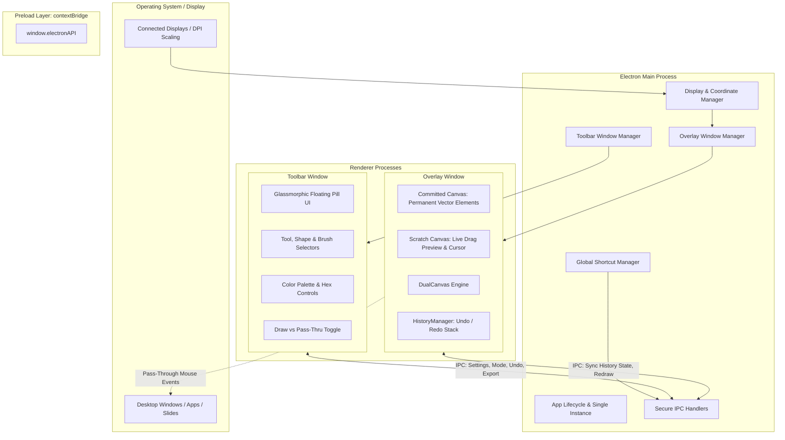

# ScreenCanvas — Technical Architecture

This document describes the design, system architecture, rendering pipeline, and IPC communication protocols implemented in **ScreenCanvas**.

---

## 1. High-Level System Architecture

ScreenCanvas uses Electron with a multi-window, context-isolated architecture that separates the heavy drawing canvas from the interactive floating toolbar.



---

## 2. Window Architecture & Mouse Pass-Through

### The Two-Window Paradigm
In Windows desktop environments, a single full-screen transparent window attempting to handle both interactive UI controls and full-screen transparent click-through frequently suffers from hit-test clipping or hover-lag when using `setIgnoreMouseEvents(true, { forward: true })`.

ScreenCanvas solves this by dividing responsibilities:
1. **Overlay Window (`overlayWindow`)**:
   - `transparent: true`, `frame: false`, `alwaysOnTop: true`, `skipTaskbar: true`.
   - In **Drawing Mode**: `setIgnoreMouseEvents(false)` intercepts all stylus and mouse gestures for continuous, fluid drawing.
   - In **Pass-Through Mode**: `setIgnoreMouseEvents(true, { forward: true })` forwards every mouse click to whatever window is behind it (code editors, browsers, presentations). Annotations remain visible on screen.
2. **Toolbar Window (`toolbarWindow`)**:
   - Compact floating window styled with glassmorphism.
   - Always clickable (`alwaysOnTop: true`, never ignores mouse events).
   - Draggable using `-webkit-app-region: drag` so presenters can position it anywhere across displays.

---

## 3. High-Performance Dual-Canvas Drawing Engine

### Vector Scene Graph vs Raster Snapshots
Many simple canvas applications capture full-screen raster bitmaps on every stroke to implement undo. On a 4K display, a single RGBA frame buffer consumes ~33 MB of memory; 30 undo steps would consume ~1 GB of RAM and cause perceptible GC pauses.

ScreenCanvas implements a **Vector Scene Graph**:
- Each stroke or shape is stored as a lightweight data structure (`DrawingElement`):
  ```typescript
  type DrawingElement = PathElement | ShapeElement | ArrowElement | TextElement;
  ```
- Memory footprint is less than a few kilobytes for hundreds of strokes.
- Completely DPI-independent and scalable to any screen resolution.
- Enables **Object-Level Erasing**: clicking or brushing over a stroke removes that specific element cleanly.

### Dual-Layer Rendering
To achieve zero input latency and 60–120 FPS drawing without triggering React reconciliation:
1. **Committed Canvas (Bottom Layer)**:
   - Holds all finalized vector strokes and shapes.
   - Only repaints when an element is completed, undone, or erased.
2. **Scratch / Preview Canvas (Top Layer)**:
   - Captures active pointer movement (`pointermove`).
   - Draws immediate stroke feedback or live shape outlines (e.g. line, arrow, rectangle, circle preview).
   - Draws custom circular eraser feedback.
   - Uses zero React state updates during drag gestures.
   - On `pointerup`, the committed element is appended to `HistoryManager`, the scratch canvas is wiped, and the committed canvas updates.

### Bezier Path Smoothing
Strokes drawn with `pen` and `marker` pass through a quadratic Bezier curve midpoint interpolation filter (`quadraticCurveTo`), eliminating jagged angles from discrete mouse/stylus polling events.

---

## 4. Multi-Monitor Coordinate System

The `DisplayManager` uses Electron's `screen` API:
- `screen.getAllDisplays()` detects all active monitors, including secondary monitors with negative virtual coordinates (e.g. `x = -1920, y = 0`).
- High-DPI displays (e.g. 125%, 150%, 200% Windows scaling) are handled by multiplying internal canvas pixel dimensions by `window.devicePixelRatio` and calling `ctx.scale(dpr, dpr)`.
- Selecting a display re-bounds the overlay window via `overlayWindow.setBounds(display.bounds)` seamlessly.

---

## 5. Security & IPC Design

- **Context Isolation**: `contextIsolation: true` is strictly enforced.
- **Node Integration Disabled**: `nodeIntegration: false` prevents any renderer script from accessing Node standard libraries or the file system directly.
- **Preload Interface**: A secure, minimal API is exposed to `window.electronAPI` using `contextBridge.exposeInMainWorld`.
- **File System Protection**: File saving for exported PNGs and screenshots is handled strictly by the Electron main process via native system dialogs (`dialog.showSaveDialog`), validating paths and preventing arbitrary file overwrites.

---

## 6. Windows System Tray Daemon & Lifecycle

ScreenCanvas integrates with the Windows Notification Area (System Tray) via `TrayManager`:
- **Native Bitmap Generation**: Generates 16×16 RGBA bitmap buffers dynamically via `generateTrayIcon()` without static file dependencies.
- **Dynamic Context Menu**: Right-click menu allows one-click toolbar visibility toggling, drawing mode switching (`Ctrl+Shift+D`), clearing the screen (`Ctrl+Shift+X`), and quitting (`Ctrl+Q`).
- **Synchronized Teardown**: Closing or exiting destroys all windows, cleans up tray handles, unregisters global shortcuts, and terminates cleanly without lingering processes or ghost overlays.

---

## 7. Session Persistence & Sequential Step Badges

### Session Auto-Recovery (`sessionPersistence.ts`)
- Automatically caches vector elements and active canvas settings to versioned storage.
- On launch, previous annotations and whiteboard sketches are instantly restored.
- Clearing the canvas cleanly clears persisted storage.

### Sequential Step Stamps (`StampElement`)
- Specialized callout stamps (①, ②, ③...) with automatic integer incrementing.
- Live preview indicator rendered on the scratch layer under the cursor before click placement.
- One-click sequence reset in toolbar controls.

